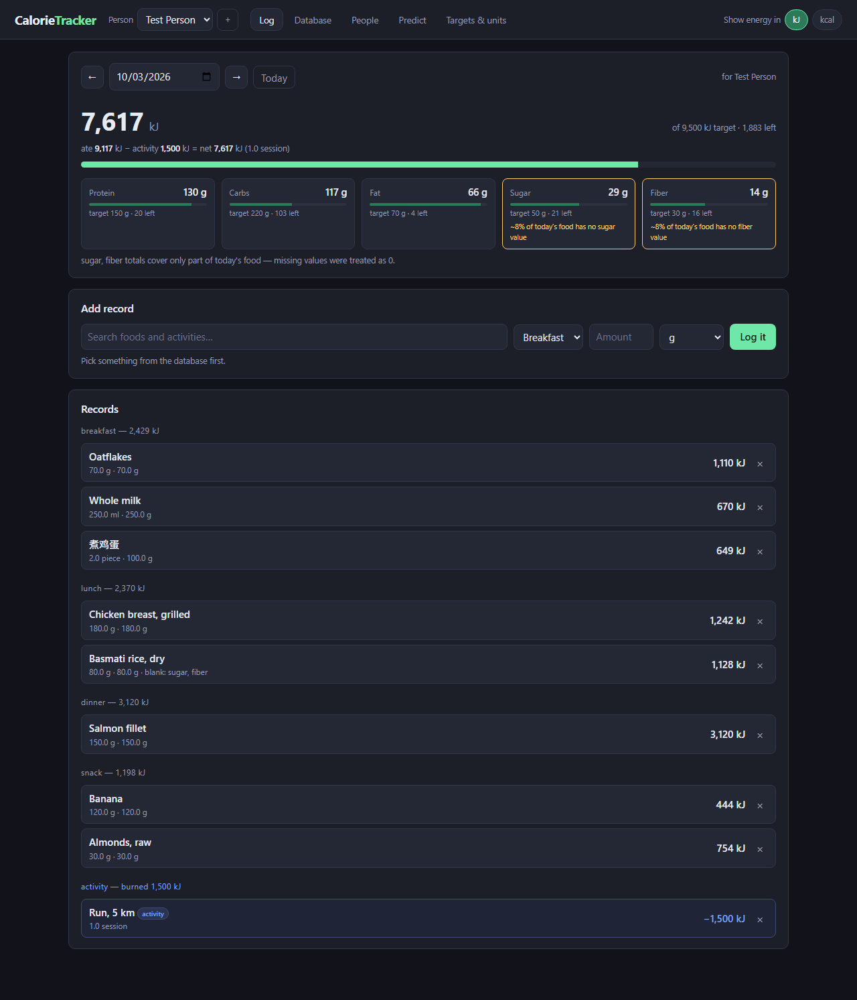
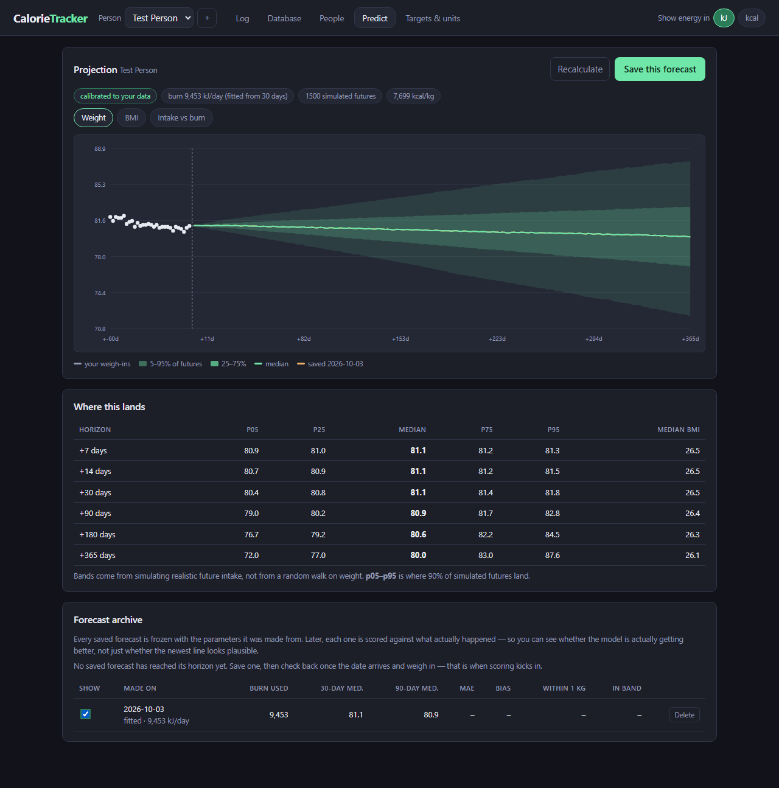
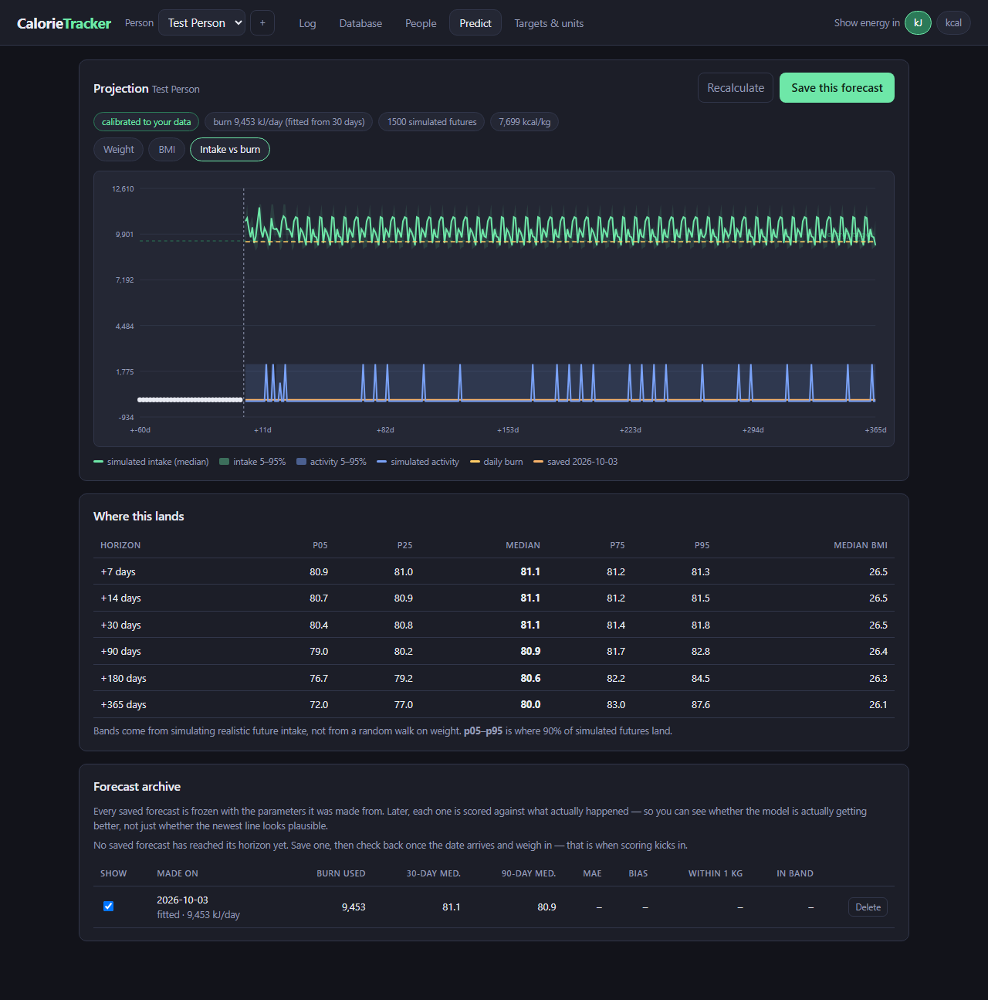
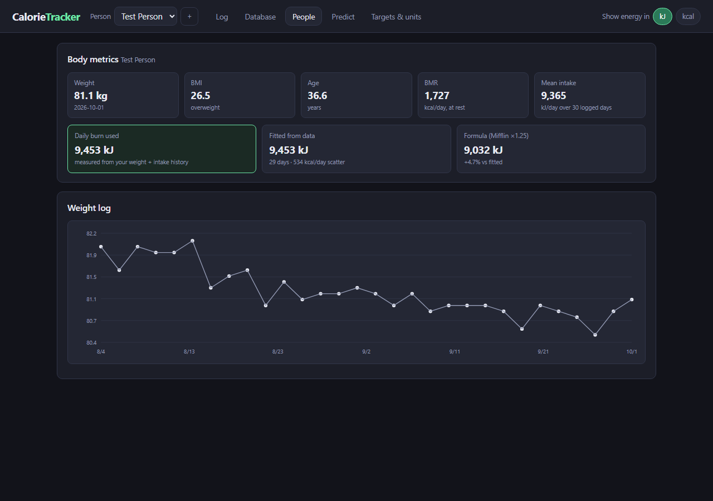
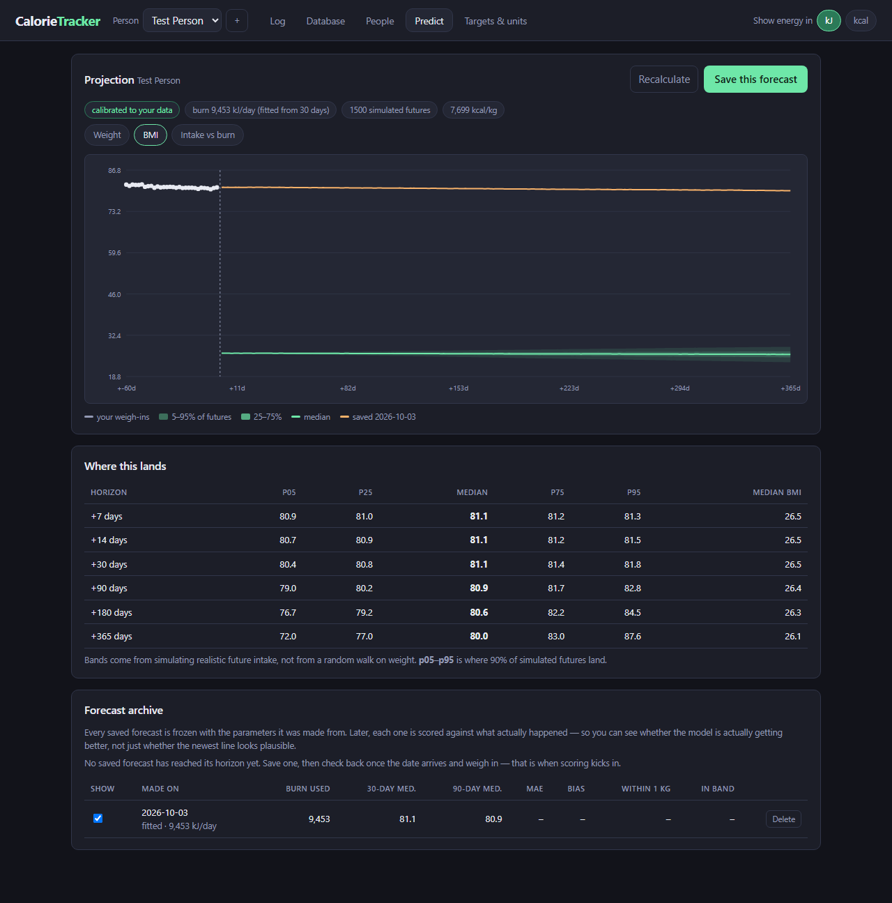
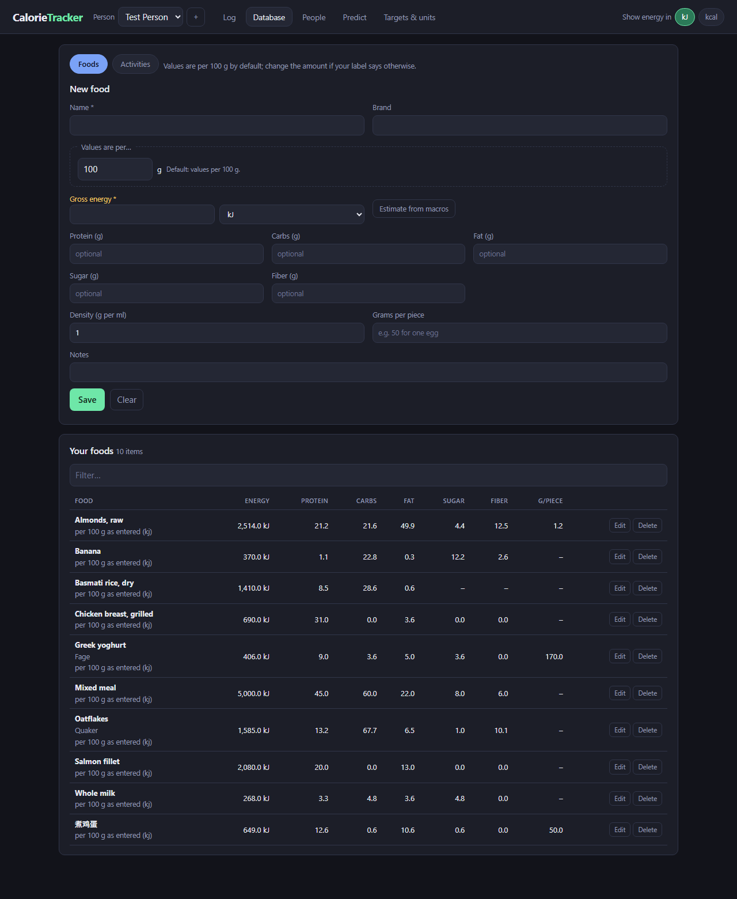
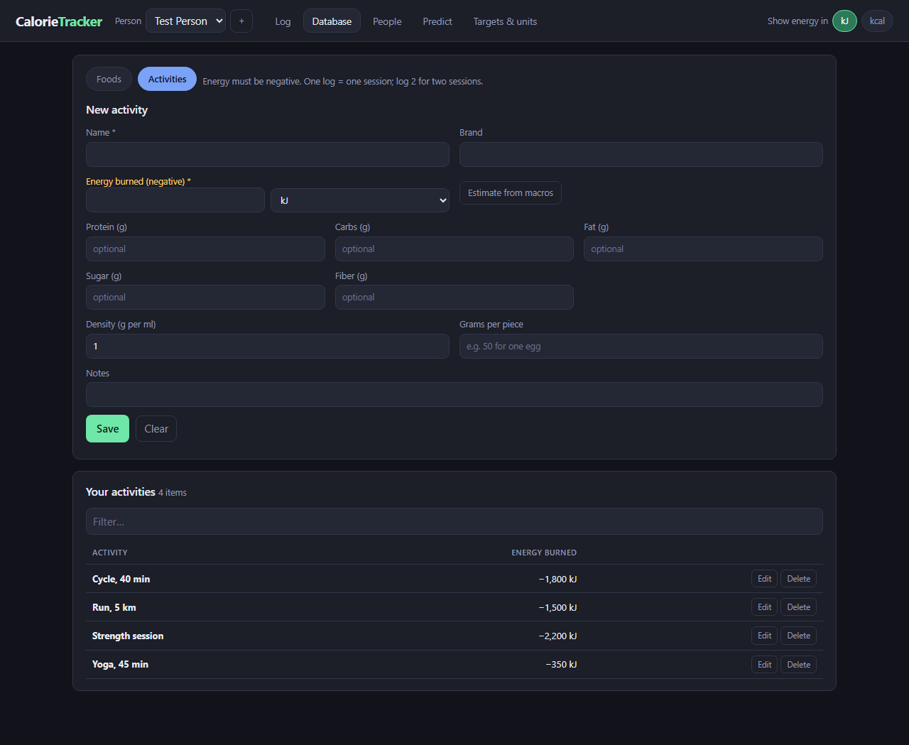
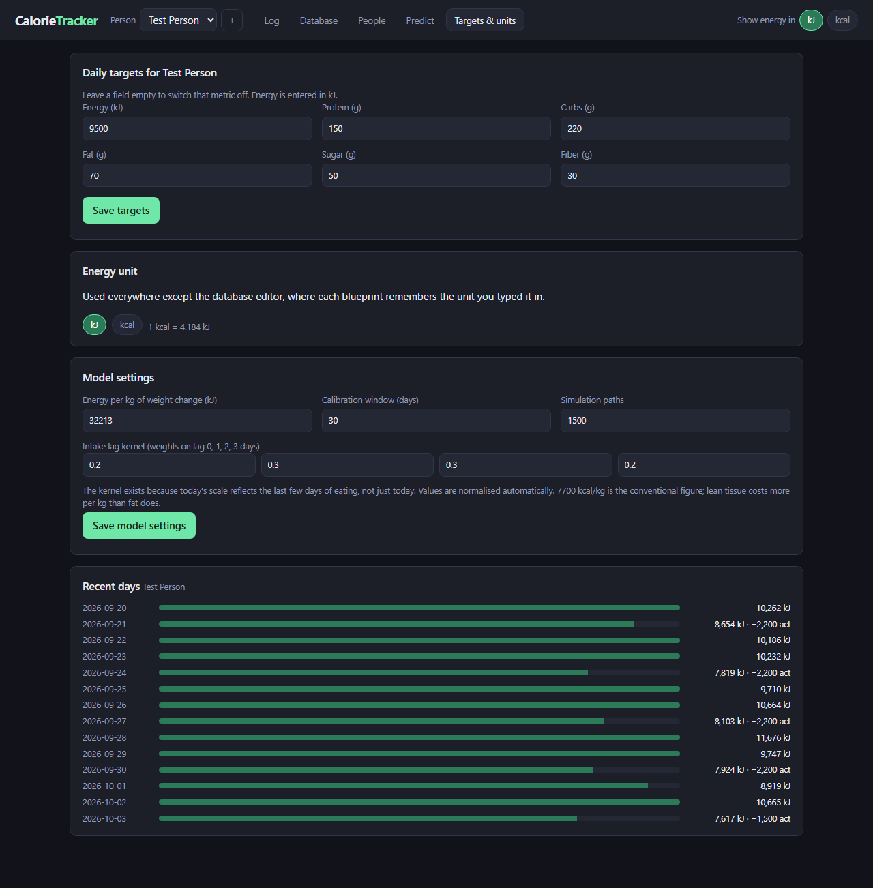

<div align="center">

# CalorieTracker

**A local, multi-person calorie and body-composition tracker.**

You build your own food database by typing what is on the package.
Log foods and exercise by how much you had.
The app fits *your* daily energy burn from *your* weight history,
then projects where you are heading.

No accounts · no cloud · no API keys · one SQLite file

</div>

---

## Screenshots

<!--
  Two-up grid. Two things learned the hard way, both preserved here:

  1. The width goes on each , not the <td>. github-markdown-css sets
     `table { width: max-content }`, so td width="50%" is ignored.
  2. Keep the in-cell captions to a few words. A max-content table sizes to the
     widest caption line, so a 60-character caption silently overrides the image
     width and pushes the grid past the content column. The prose lives below.
-->

<div align="center">
<table>
<tr>
<td valign="top" align="center"><br><sub><b>Day view</b></sub></td>
<td valign="top" align="center"><br><sub><b>Projection</b></sub></td>
</tr>
<tr>
<td valign="top" align="center"><br><sub><b>Intake vs. burn</b></sub></td>
<td valign="top" align="center"><br><sub><b>Body metrics</b></sub></td>
</tr>
</table>
</div>

**Day view** — net energy with activity shown honestly, a tile per macro against
its target, records grouped by meal, and amber warnings on any nutrient whose
total is only partly covered by what you actually recorded.

**Projection** — your weigh-ins, today marked, and a band from 1500 simulated
futures, tabulated at 7 / 14 / 30 / 90 / 180 / 365 days.

**Intake vs. burn** — simulated future intake against the fitted burn, which is
what actually makes the weight curve bend.

**Body metrics** — the fitted burn beside the formula estimate, with the residual
scatter and how many days it used. They converge as your history builds.

<details>
<summary><b>More screenshots</b> — BMI projection, the database, targets</summary>

<div align="center">
<table>
<tr>
<td valign="top" align="center"><br><sub><b>BMI</b></sub></td>
<td valign="top" align="center"><br><sub><b>Foods</b></sub></td>
</tr>
<tr>
<td valign="top" align="center"><br><sub><b>Activities</b></sub></td>
<td valign="top" align="center"><br><sub><b>Targets &amp; model</b></sub></td>
</tr>
</table>
</div>

</details>

---

## Quick start

```powershell
python -m pip install -r requirements.txt
python run.py
```

Then open <http://127.0.0.1:8000>. Requires Python 3.10+; no build step.

On first run you create a person, then add a few foods, then start logging.

---

## The one idea to understand

This distinction runs through the whole codebase:

| | what it is | belongs to |
| --- | --- | --- |
| **blueprint** | the reusable definition — `煮鸡蛋`, 649 kJ per 100 g | nobody |
| **record** | one instance of a blueprint, in an amount, on a day | exactly one person |

Blueprints are shared by everyone. Records are private to their person. A record
is **never** split between people — if two people ate the same thing, that is
two records.

---

## How the energy model works

```
Δweight/day  =  ( food − logged activity − burn ) / 32213 kJ/kg
```

`burn` is everything you spend that is **not** deliberate logged activity:
resting metabolism, everyday movement, and the thermic effect of food. It is
estimated two ways, and the measured one wins as soon as it is available:

| | method | available |
| --- | --- | --- |
| **formula** | Mifflin-St Jeor BMR × movement multiplier | immediately |
| **fitted** | closed-form least squares on your weight + intake history | after ~7 days with 2 weigh-ins |

Fitting has one unknown and a fixed slope, so it is exact rather than iterative:

```
burn = mean( lagged_intake − Δweight × 32213 )
```

Three details that matter more than they look:

- **A 4-day intake lag kernel.** Today's scale reflects several days of eating,
  not just today — water, glycogen, gut contents. Intake is smoothed before the
  comparison, which keeps the fit from chasing noise.
- **Weight is interpolated, never extrapolated.** Weigh-ins are spread linearly
  between them and the series stops at your most recent weigh-in. The model
  never claims to know a weight you have not measured.
- **A plausibility guard.** If the fitted burn lands outside 0.5×–2× the formula
  estimate it is rejected and the formula is used instead, with an explanation.
  One mistyped weight, or one record logged in the wrong unit, would otherwise
  imply a burn of 1 MJ/day and produce a completely fictional forecast.

**Measured accuracy.** `tests/test_body.py` generates synthetic people whose true
burn is planted in advance. The fit recovers 7968 / 9969 / 12470 kJ against
planted 8000 / 10000 / 12500, and holds within 1% whether exercise is logged
daily or every 30th day.

---

## How the projection works

**Uncertainty is placed in the inputs, never in the weight.** Weight is the
integral of the energy balance, so simulating it directly compounds error into a
random walk whose band is useless within a year. Instead:

1. Take the person's **completed** days. Today is never used — an unfinished day
   would drag the fit.
2. Resample realistic future intake by **block bootstrap**: draw real 3–7 day
   blocks, stratified by day of week, keeping each day's intake paired with its
   activity. This preserves the weekly rhythm and serial correlation.
3. Push ~1500 paths through the deterministic equation above.
4. Report percentiles, and draw burn uncertainty into each path so parameter
   error shows up in the band instead of being hidden.

The result is tight at two weeks and honest at a year — rather than uniformly
vague, or falsely precise.

### Why not a Markov chain?

A first-order Markov chain over intake needs a K×K transition matrix: roughly
200–400 days of data for 5 states. With a 30-day calibration window you would be
fitting 20 parameters from 30 observations, and a confidently-wrong matrix
produces bands that are *too narrow* — precise exactly when it has no right to be.

Measured day-to-day energy-intake autocorrelation in adults is weak
(r ≈ 0.1–0.3). At that level "tomorrow ≈ your mean" is nearly as good a
forecast, so the simulated paths come out almost identical to plain resampling.
The block bootstrap gives the same *future looks like the past, dependence
included* with zero fitted parameters.

---

## The forecast archive, and scoring it against reality

**Save this forecast** freezes the current projection together with the
parameters it was made from: fitted burn, kJ/kg, lag kernel, seed, model
version. Snapshots are immutable on purpose — if old forecasts were silently
recomputed with an improved model, you could never tell whether it had actually
got better.

Once a horizon date passes and there is a real weigh-in near it, every saved
forecast is scored:

| metric | meaning |
| --- | --- |
| **MAE** | mean absolute error, kg |
| **Bias** | signed. Positive = you weighed more than predicted |
| **Within 1 kg** | how often the median was close |
| **In band** | how often reality landed inside the 5–95% band |

That last one is the honesty check on the model itself: far below 90% and the
band is lying about its own confidence; far above and it is needlessly wide.

A horizon with no weigh-in within ±4 days is skipped rather than scored against
a stale number. Tick any subset of saved forecasts to overlay them on the chart.

---

## Honest reporting

This is a deliberate design constraint, not a feature list.

- **Missing nutrient values are surfaced, never silently zeroed.** Each nutrient
  carries a *coverage* figure — the share of the day's food that actually had a
  value. Affected tiles are outlined and annotated (`~8% of today's food has no
  sugar value`). A nutrient nothing was recorded for reads **`no data`**, never
  `0 g`.
- **Energy is required** when creating a blueprint. But if a row somehow has
  none, the day falls back to Atwater factors (17/17/37 kJ per g) and is tagged
  `est.`; with nothing at all it reports `unavailable` rather than `0`.
- **Cold start is labelled.** With a weight but no food history the projection
  runs off the formula and is stamped *uncalibrated*, with a note on what to do
  about it. With no weight at all it refuses and says so.
- **Activity never touches macros.** A 10 km run cannot subtract 40 g of protein.
  Activity reduces the energy total and nothing else.

---

## Design decisions

- **Energy is stored in kJ**, because most packaging prints kJ. Each blueprint
  remembers the unit it was typed in, so editing a kcal-entered food brings the
  kcal selector back. Everything else follows one global display setting.
  Conversion is exact: 1 kcal = 4.184 kJ.
- **Values may be entered per any gram amount**, default 100 g. Enter 250 when
  that is what the label says; it is rescaled to per-100 g on save, so foods stay
  comparable and every log calculation stays a multiplication.
- **Only energy is required.** Protein, carbs, fat, sugar and fiber are optional,
  and the app tells you when a total is incomplete rather than pretending.
- **Logging units are g, ml and piece.** `piece` only appears once a
  grams-per-piece weight is set — logging "2 pieces" of something with no weight
  defined is rejected, not guessed.
- **Targets are per person.** Blank a field to switch that metric off.
- **Your database stays yours.** `calorie_tracker.db` is gitignored and is never
  uploaded anywhere by this project.

---

## Project layout

```
app/
  db.py          schema + non-destructive migration (no ORM, no external DB)
  body.py        BMR, weight interpolation, lag kernel, burn fit, bootstrap
  nutrition.py   unit conversion, per-100 g normalisation, coverage aggregation
  repo.py        queries: blueprints, records, people, weights, forecasts
  main.py        FastAPI routes + request validation
  templates/     single page
  static/        style.css, app.js — hand-rolled SVG charts, zero JS deps
tests/
  test_body.py       model maths, checked against planted answers
  test_core.py       blueprints, units, coverage, CRUD
  test_people.py     people, weights, records, activities, forecasts, scoring
  test_migration.py  old schema -> new; data preserved, idempotent
  test_ui.py         drives real Chromium; fails on any console error
  screenshot.py      regenerates the images in docs/screenshots/
```

`body.py` performs no I/O, which is why the maths can be tested directly against
known answers instead of being inferred from the UI.

---

## Tests

**276 checks, no test framework**, every one against a throwaway database.

```powershell
python tests/test_body.py        # model maths
python tests/test_core.py        # blueprints, units, coverage
python tests/test_people.py      # people, forecasts, scoring
python tests/test_migration.py   # schema migration

# browser tests:
python -m pip install playwright
python -m playwright install chromium
python tests/test_ui.py

python tests/screenshot.py       # regenerate docs/screenshots/
```

---

## API

Interactive docs at `/docs` once the server is running.

| Method | Path | Purpose |
| --- | --- | --- |
| `GET` | `/api/config` | settings, people, constants |
| `GET` | `/api/foods?kind=food\|activity` | list, per-100 g in the display unit |
| `POST` `PUT` `DELETE` | `/api/foods[/{id}]` | blueprints |
| `POST` | `/api/foods/{id}/derive-energy` | estimate energy from macros |
| `GET` `POST` `PUT` `DELETE` | `/api/persons[/{id}]` | people; targets live here |
| `GET` | `/api/persons/{id}/metrics` | weight, BMI, BMR, both burn estimates |
| `GET` `POST` | `/api/persons/{id}/weights` | weight log, one per day |
| `POST` `DELETE` | `/api/entries[/{id}]` | records |
| `GET` | `/api/day/{date}?person_id=` | totals, coverage, per-meal, targets |
| `GET` | `/api/history?person_id=&days=` | recent days |
| `GET` | `/api/persons/{id}/forecast?save=true` | project, optionally freeze |
| `GET` | `/api/persons/{id}/forecasts` | archive + scorecard |
| `PUT` | `/api/settings` | display unit, model constants |

---

## Licence

[MIT](LICENSE) — use it, fork it, change it. The only conditions are keeping the
copyright notice and licence text in copies you distribute.

If you fork this and publish it as a service rather than a tool, consider whether
you actually want it to stay MIT.

## Not built

Recipes, barcode scanning, favourites, body-fat percentage, CSV export, cloud
sync, multi-user auth. The schema has room for them; they are simply not there.
